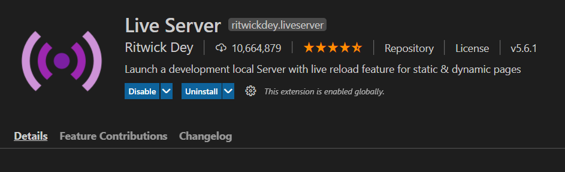
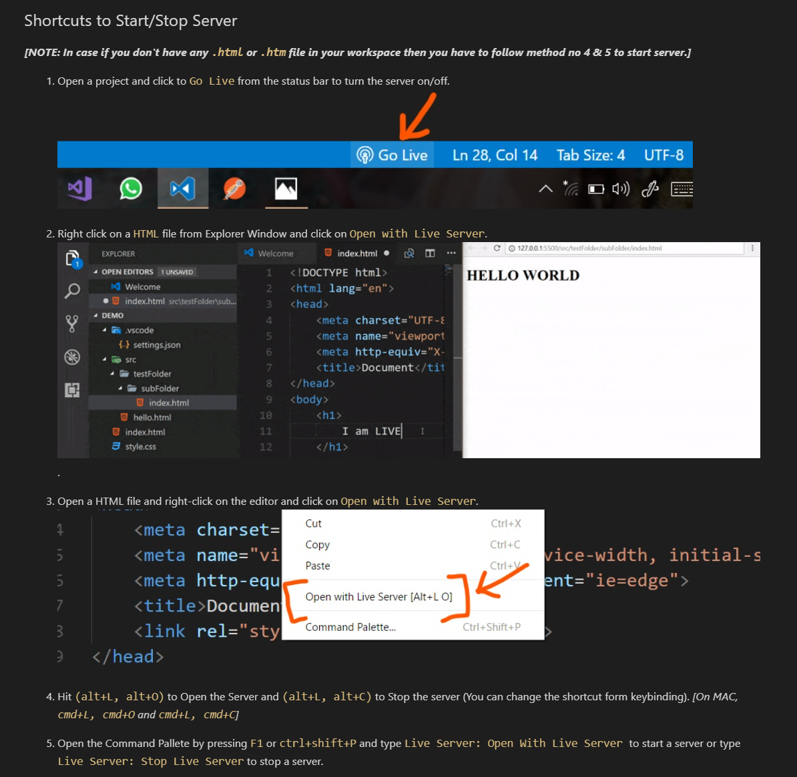

#### 📌 요약
- Live Server 켜는 단축키: **html 파일을 선택**한 후,    
Window: `Alt + L + O`   
Mac: `Option + L + O`

#### 💡 그래도 안된다면!    
**html파일**로 **저장**을 했는지!    
ex) test.html(이처럼 확장자가 html 파일이어야 한다)

**왼쪽 Explorer 창**에 실행하고자 하는 파일이 있는지!
(경로 문제입니다. 파일 위치 확인해주세요!)

___

#### 📌 세부 설명
##### Live Server 설치 완료된 상태

##### 하단 이미지 설명과 같이 

- Live Server는 html과 htm파일을 지원한다

 ___
마지막 업데이트: 2021.03.27
